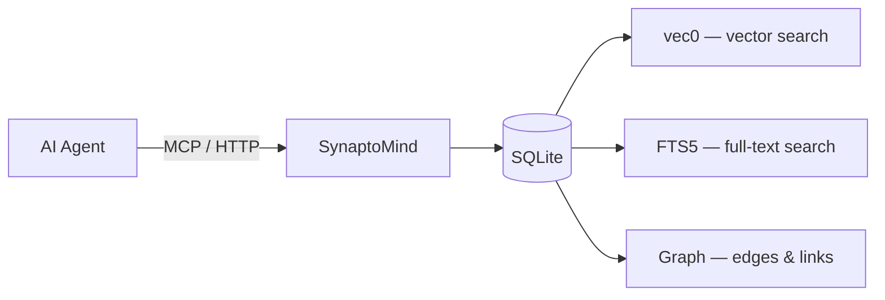
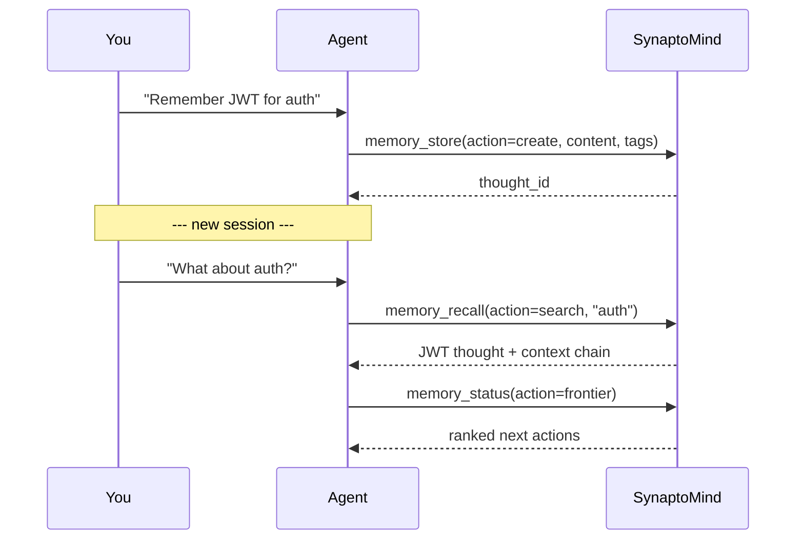

# SynaptoMind

[](https://github.com/zumik3-del/synaptomind/actions/workflows/ci.yml)
[](https://coveralls.io/github/zumik3-del/synaptomind?branch=main)
[](https://github.com/zumik3-del/synaptomind/releases)
[](LICENSE)
[](https://ghcr.io/zumik3-del/synaptomind)
[](https://bun.sh)

**Local persistent memory for AI agents.** Your agent remembers decisions, goals, and context across sessions — via MCP or HTTP API. Data stays on your machine.



**Works with** Claude Desktop · Cursor · OpenCode · Codex · any MCP client

---

## Try in 2 minutes

```bash
git clone https://github.com/zumik3-del/synaptomind.git && cd synaptomind
bun install
bun run src/index.ts
```

Server starts on `http://127.0.0.1:3005`. MCP endpoint: `http://127.0.0.1:3006/mcp`.

Connect your client — add to Claude Desktop config (`claude_desktop_config.json`):

```json
{
  "mcpServers": {
    "synaptomind": {
      "url": "http://127.0.0.1:3006/mcp",
      "headers": { "Authorization": "Bearer YOUR_TOKEN" }
    }
  }
}
```

The token is printed to stderr on first startup. That's it — your agent now has persistent memory.

---

## Use Cases

- **Coding agent memory** — architecture decisions, bug root causes, TODOs persist between sessions
- **Project journal** — decisions and goals as a connected graph, not scattered notes
- **Idea graph** — capture thoughts, let semantic search find connections you missed
- **MCP memory backend** — plug persistent memory into any MCP-compatible agent

---

## Example: Auth Decision Across Sessions

```
You: "Remember: we chose JWT for auth, refresh tokens in httpOnly cookies"

Agent: [memory_store action=create — tags: auth, jwt, security]

--- new session ---

You: "What did we decide about auth?"

Agent: [memory_recall action=search "auth decision" → finds JWT thought with full context]

You: "What should I do next?"

Agent: [memory_status action=frontier → "Implement refresh token rotation" ranked #1]
```

Core loop: **capture → link → retrieve → act**. No manual organization — the graph connects related thoughts automatically.



---

## SynaptoMind vs Alternatives

| Feature | SynaptoMind | Basic Memory | Mem0 | Zep | Cognee |
|---------|:-----------:|:------------:|:----:|:---:|:------:|
| **Self-hosted** | ✅ | ✅ | ✅ | ✅ | ✅ |
| **Local-first** | ✅ | ✅ | ❌ | ❌ | ❌ |
| **No API keys needed** | ✅ | ✅ | ❌ | ❌ | ❌ |
| **Knowledge graph** | ✅ | ✅ | ❌ | ❌ | ❌ |
| **Vector search** | ✅ | ✅ | ✅ | ✅ | ✅ |
| **Full-text search** | ✅ | ✅ | ❌ | ❌ | ❌ |
| **MCP server** | ✅ | ✅ | ✅ | ✅ | ✅ |
| **Smart notes (auto-surfacing)** | ✅ | ❌ | ❌ | ❌ | ❌ |
| **Frontier (next-action ranking)** | ✅ | ❌ | ❌ | ❌ | ❌ |
| **Local embeddings** | ✅ | ✅ | ❌ | ❌ | ❌ |
| **Runtime** | Bun | Python | Python | Python | Python |
| **License** | MIT | AGPL-3.0 | Apache-2.0 | Apache-2.0 | Apache-2.0 |

**What makes SynaptoMind different:** Graph-native thought storage with semantic search, smart notes that auto-surface when relevant, and Frontier ranking — all running locally with zero external dependencies. MIT licensed.

---

## Features

<details>
<summary><strong>Core concepts — what makes this more than a note app</strong></summary>

| Concept | What it does |
|---------|-------------|
| **Thoughts** | Individual notes/ideas. Each gets an embedding for semantic search and links to other thoughts. |
| **Smart Notes** | Thoughts with surface conditions. They auto-surface when relevant context arrives — e.g., "remind me about auth when I start a session" — and self-promote when enough evidence accumulates. |
| **Slots** | Context windows summarizing your state: persona, goals, architecture decisions. Agents read these on startup. |
| **Frontier** | Ranks "what to do next" based on your thought graph. Most actionable, connected, timely items first. |
| **Primer** | Compact project summary for quick context injection. Promotes the most relevant thoughts into one document. |
| **Crystals** | Compressed markdown from thought clusters — runbooks, decision logs, overviews. |

</details>

<details>
<summary><strong>Technical capabilities</strong></summary>

- **Graph storage** — thoughts, edges, projects, tags, smart notes in SQLite
- **Hybrid search** — vector (vec0) + BM25 (FTS5) + entity matching
- **Local embeddings** — `@huggingface/transformers`, no API keys
- **MCP server** — stdio + HTTP transport
- **Auto-clustering** — batch grouping by embedding proximity
- **Background jobs** — decay, dreamer, self-improve, git sync

</details>

---

## Connecting MCP Clients

<details>
<summary><strong>Claude Desktop</strong></summary>

Edit `~/Library/Application Support/Claude/claude_desktop_config.json`:

```json
{
  "mcpServers": {
    "synaptomind": {
      "url": "http://127.0.0.1:3006/mcp",
      "headers": { "Authorization": "Bearer YOUR_TOKEN" }
    }
  }
}
```

</details>

<details>
<summary><strong>Cursor</strong></summary>

Add to `.cursor/mcp.json` in your project or global config:

```json
{
  "mcpServers": {
    "synaptomind": {
      "url": "http://127.0.0.1:3006/mcp",
      "headers": { "Authorization": "Bearer YOUR_TOKEN" }
    }
  }
}
```

</details>

<details>
<summary><strong>OpenCode</strong></summary>

Add to `~/.config/opencode/opencode.json`:

```json
{
  "mcp": {
    "synaptomind": {
      "type": "remote",
      "url": "http://127.0.0.1:3006/mcp",
      "headers": { "Authorization": "Bearer YOUR_TOKEN" }
    }
  }
}
```

</details>

<details>
<summary><strong>Stdio transport</strong></summary>

For clients that prefer stdio:

```json
{
  "command": "bun",
  "args": ["run", "/path/to/synaptomind/src/index.ts", "--stdio"],
  "env": { "SYNAPTOMIND_SECRET": "your-token" }
}
```

</details>

<details>
<summary><strong>Codex (OpenAI)</strong></summary>

See [docs/codex-plugin.md](docs/codex-plugin.md) for installation and usage.

</details>

---

## Configuration

All settings in `config.json`. Priority: env vars > config.json > defaults.

| Setting | Default | Description |
|---------|---------|-------------|
| `server.port` | 3005 | HTTP API port |
| `server.host` | 127.0.0.1 | Bind address |
| `mcp.httpPort` | 3006 | MCP HTTP transport port |
| `embedder.model` | Xenova/multilingual-e5-small | HuggingFace embedding model |
| `db.path` | ./data/synaptomind.db | SQLite database path |

Auth tokens via env vars only:

| Env var | Purpose |
|---------|---------|
| `SYNAPTOMIND_SECRET` | Primary auth token (API + MCP) |
| `SYNAPTOMIND_SERVICE_TOKEN` | Secondary token (optional) |

Without these, a random UUID is generated at startup and printed to stderr.

See `config.json.example` for all options. Custom MCP instructions: [docs below](#custom-instructions).

---

<details>
<summary><strong>Docker</strong></summary>

### From source (development)

```bash
docker compose up -d
```

Volumes mount `./data` and `./config.json`.

### Published image (production)

Edit `docker-compose.yml` — uncomment `image`, comment `build`:

```yaml
image: ghcr.io/zumik3-del/synaptomind:0.2.1
# build: .
```

```bash
docker compose pull && docker compose up -d
```

### Auth

```bash
echo "SYNAPTOMIND_SECRET=your-secret-token" > .env
```

See `.env.example` for all variables. Without `.env`, a random token is generated per restart.

</details>

<details>
<summary><strong>Server installation</strong></summary>

### Prerequisites

- [Bun](https://bun.sh/)
- Docker + Docker Compose
- Git

### First install

```bash
bash scripts/deploy.sh
```

Clones to `/opt/synaptomind`, checks out latest release, installs deps, starts container.

```bash
bash scripts/deploy.sh              # latest stable release
bash scripts/deploy.sh --alpha      # latest prerelease (alpha/beta/rc)
bash scripts/deploy.sh 0.2.1        # specific version
bash scripts/deploy.sh --dev        # main branch (development)
```

### Updating

```bash
bash scripts/update.sh
```

Shows current vs latest version, lists changes, asks for confirmation.

</details>

<details>
<summary><strong>API reference</strong></summary>

All `/api/*` endpoints require `Authorization: Bearer <token>` header.

### Create a thought

```bash
curl -X POST http://127.0.0.1:3005/api/thoughts \
  -H "Authorization: Bearer $SYNAPTOMIND_SECRET" \
  -H "Content-Type: application/json" \
  -d '{"content": "First session went well", "tags": ["retrospective"]}'
```

### Search thoughts

```bash
curl "http://127.0.0.1:3005/api/thoughts/search?q=session+retrospective&limit=5" \
  -H "Authorization: Bearer $SYNAPTOMIND_SECRET"
```

### Health check

```bash
curl http://127.0.0.1:3005/health
```

</details>

<details>
<summary><strong>MCP tools</strong></summary>

| Category | Tools |
|----------|-------|
| Recall | `memory_recall` (search, get, context, chain, clusters) |
| Store | `memory_store` (create, update, link, smart_note_*) |
| Supersede | `memory_supersede` (archive, merge) |
| Status | `memory_status` (slots, frontier, profile, config, health) |
| Projects | `memory_manage` (list, create, update, delete, resolve) |
| Consolidate | `memory_crystallize` (crystallize, graph, cluster, auto_cluster) |
| Reflect | `memory_reflect` (reflect, timeline) |
| Telemetry | `memory_telemetry` (query, analyze, primers) |
| Git | `memory_git` |
| Guide | `memory_guide` |

</details>

---

## Custom Instructions

The MCP server sends instructions to the AI agent on startup. To customize:

1. Create a markdown file (e.g., `instructions.md`)
2. Set the path in `config.json`:

```json
"mcp": {
  "instructionsFile": "./instructions.md"
}
```

Or via env var:

```bash
export SYNAPTOMIND_MCP_INSTRUCTIONS_FILE=./instructions.md
```

Falls back to default instructions if file not found.

---

## Development

```bash
bun test          # run tests
bunx biome check src/   # lint (advisory)
```

For step-by-step usage scenarios, see [docs/SCENARIOS.md](docs/SCENARIOS.md).

---

## Contributing

See [CONTRIBUTING.md](CONTRIBUTING.md).

## License

[MIT](LICENSE)

---

## Topics

`mcp` `mcp-server` `ai-memory` `agent-memory` `llm-memory` `persistent-memory` `self-hosted` `local-first` `knowledge-graph` `semantic-search` `ai-agents` `sqlite` `rag`
