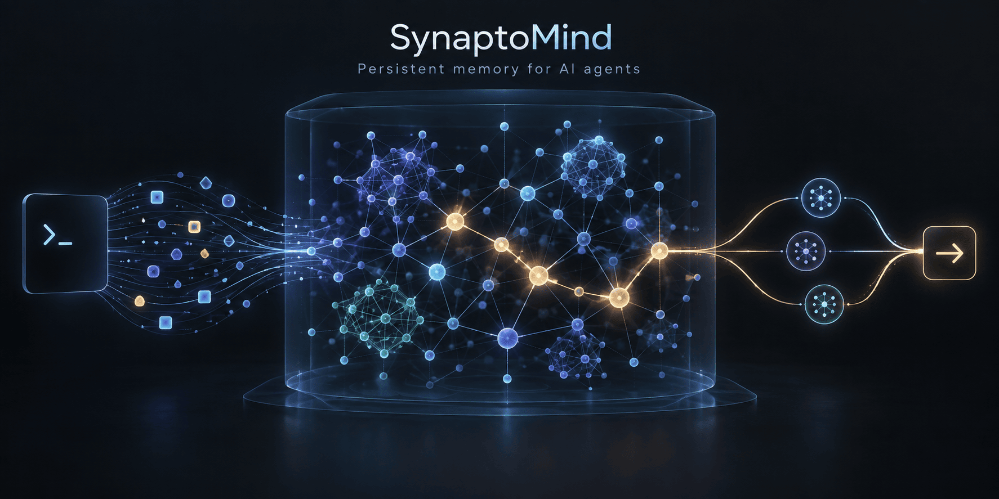
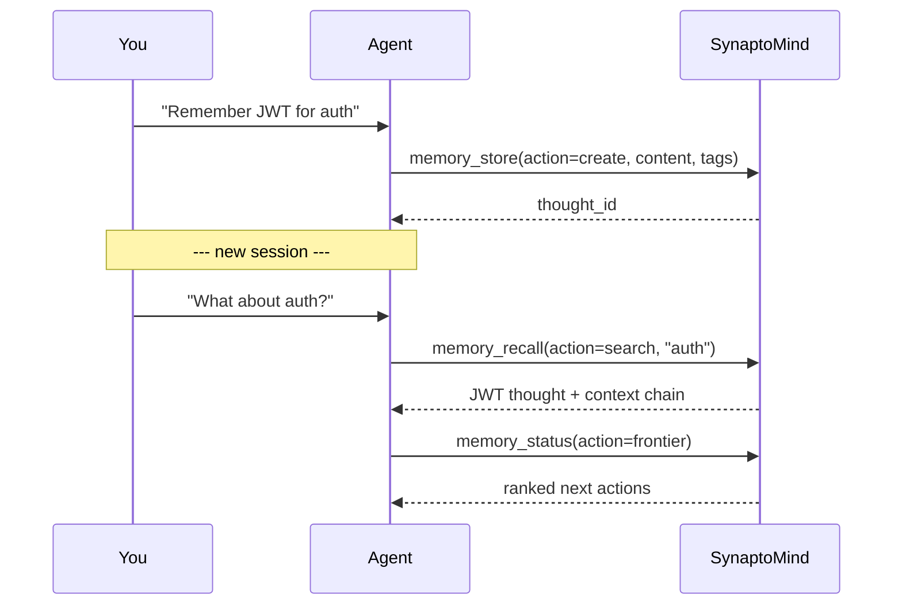
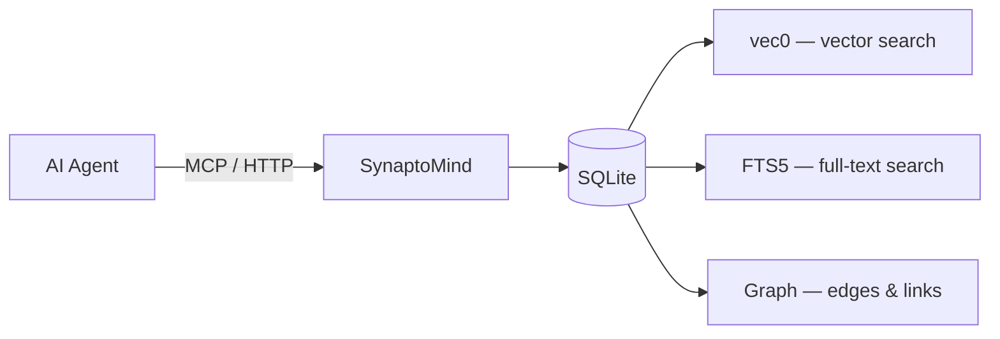

# SynaptoMind

[](https://github.com/zumik3-del/synaptomind/actions/workflows/ci.yml)
[](https://github.com/zumik3-del/synaptomind/actions/workflows/codeql.yml)
[](https://github.com/zumik3-del/synaptomind/actions/workflows/security.yml)
[](https://coveralls.io/github/zumik3-del/synaptomind?branch=main)
[](https://github.com/zumik3-del/synaptomind/releases)
[](LICENSE)
[](https://ghcr.io/zumik3-del/synaptomind)
[](https://bun.sh)

**Local persistent memory for AI agents.** Your agent remembers decisions, goals, and context across sessions — via MCP or HTTP API. Data stays on your machine.

<p align="center">
  
</p>

**Works with** Claude Desktop · Cursor · OpenCode · Codex · any MCP client

---

## Quick Start

```bash
curl -fsSL https://raw.githubusercontent.com/zumik3-del/synaptomind/main/deploy/install.sh \
  | APP_ENV_URL=https://raw.githubusercontent.com/zumik3-del/synaptomind/main/deploy/app.env \
    LIB_RAW_URL=https://raw.githubusercontent.com/zumik3-del/synaptomind/main/deploy/lib/common.sh \
    bash
```

`APP_ENV_URL` supplies the config and `LIB_RAW_URL` the shared helpers, since a
piped script has no sibling files. Server starts on `http://127.0.0.1:3005`.
MCP endpoint: `http://127.0.0.1:3006/mcp`.

Connect your client — add to Claude Desktop config (`claude_desktop_config.json`):

```json
{
  "mcpServers": {
    "synaptomind": {
      "url": "http://127.0.0.1:3006/mcp",
      "headers": { "Authorization": "Bearer YOUR_TOKEN" }
    }
  }
}
```

The installer generates `SYNAPTOMIND_SECRET` into `/opt/synaptomind/.env`; read
it with `sudo grep SYNAPTOMIND_SECRET /opt/synaptomind/.env`. That's it — your
agent now has persistent memory.

---

## Use Cases

- **Coding agent memory** — architecture decisions, bug root causes, TODOs persist between sessions
- **Project journal** — decisions and goals as a connected graph, not scattered notes
- **Idea graph** — capture thoughts, let semantic search find connections you missed
- **MCP memory backend** — plug persistent memory into any MCP-compatible agent

---

## Example: Auth Decision Across Sessions

```
You: "Remember: we chose JWT for auth, refresh tokens in httpOnly cookies"

Agent: [memory_store action=create — tags: auth, jwt, security]

--- new session ---

You: "What did we decide about auth?"

Agent: [memory_recall action=search "auth decision" → finds JWT thought with full context]

You: "What should I do next?"

Agent: [memory_status action=frontier → "Implement refresh token rotation" ranked #1]
```

Core loop: **capture → link → retrieve → act**. No manual organization — the graph connects related thoughts automatically.



---

## SynaptoMind vs Alternatives

| Feature | SynaptoMind | Basic Memory | Mem0 | Zep | Cognee |
|---------|:-----------:|:------------:|:----:|:---:|:------:|
| **Self-hosted** | ✅ | ✅ | ✅ | ✅ | ✅ |
| **Local-first** | ✅ | ✅ | ❌ | ❌ | ❌ |
| **No API keys needed** | ✅ | ✅ | ❌ | ❌ | ❌ |
| **Knowledge graph** | ✅ | ✅ | ❌ | ❌ | ❌ |
| **Vector search** | ✅ | ✅ | ✅ | ✅ | ✅ |
| **Full-text search** | ✅ | ✅ | ❌ | ❌ | ❌ |
| **MCP server** | ✅ | ✅ | ✅ | ✅ | ✅ |
| **Frontier (next-action ranking)** | ✅ | ❌ | ❌ | ❌ | ❌ |
| **Local embeddings** | ✅ | ✅ | ❌ | ❌ | ❌ |
| **Runtime** | Bun | Python | Python | Python | Python |
| **License** | MIT | AGPL-3.0 | Apache-2.0 | Apache-2.0 | Apache-2.0 |

**What makes SynaptoMind different:** Graph-native thought storage with semantic search and Frontier ranking — all running locally with zero external dependencies. MIT licensed.

---

## Features

<details>
<summary><strong>Core concepts — what makes this more than a note app</strong></summary>

| Concept | What it does |
|---------|-------------|
| **Thoughts** | Individual notes/ideas. Each gets an embedding for semantic search and links to other thoughts. |
| **Slots** | Context windows summarizing your state: persona, goals, architecture decisions. Agents read these on startup. |
| **Frontier** | Ranks "what to do next" over `directive`/`todo`/`pending` thoughts. Deferred pending items join once their `wake_days` delay has elapsed. |
| **Primer** | Compact project summary for quick context injection. Promotes the most relevant thoughts into one document. |
| **Crystals** | Compressed markdown from thought clusters — runbooks, decision logs, overviews. |

</details>

<details>
<summary><strong>Technical capabilities</strong></summary>

- **Graph storage** — thoughts, edges, projects, tags in SQLite
- **Hybrid search** — vector (vec0) + BM25 (FTS5) via Reciprocal Rank Fusion
- **Local embeddings** — `@huggingface/transformers`, no API keys
- **MCP server** — stdio + HTTP transport
- **Auto-clustering** — batch grouping by embedding proximity
- **Background jobs** — decay, self-improve, TTL cleanup

</details>

---

## Architecture

SynaptoMind runs as a single Bun process: the HTTP API on port 3005, the MCP
server on port 3006 (stdio or HTTP), and a child process that serves local
embeddings over IPC. Storage is one SQLite database using the `vec0` extension
for vector search, FTS5 for full-text search, and an edges table for the graph.



---

## Connecting MCP Clients

<details>
<summary><strong>Claude Desktop</strong></summary>

Edit `~/Library/Application Support/Claude/claude_desktop_config.json`:

```json
{
  "mcpServers": {
    "synaptomind": {
      "url": "http://127.0.0.1:3006/mcp",
      "headers": { "Authorization": "Bearer YOUR_TOKEN" }
    }
  }
}
```

</details>

<details>
<summary><strong>Cursor</strong></summary>

Add to `.cursor/mcp.json` in your project or global config:

```json
{
  "mcpServers": {
    "synaptomind": {
      "url": "http://127.0.0.1:3006/mcp",
      "headers": { "Authorization": "Bearer YOUR_TOKEN" }
    }
  }
}
```

</details>

<details>
<summary><strong>OpenCode</strong></summary>

Add to `~/.config/opencode/opencode.json`:

```json
{
  "mcp": {
    "synaptomind": {
      "type": "remote",
      "url": "http://127.0.0.1:3006/mcp",
      "headers": { "Authorization": "Bearer YOUR_TOKEN" }
    }
  }
}
```

</details>

<details>
<summary><strong>Stdio transport</strong></summary>

For clients that prefer stdio:

```json
{
  "command": "bun",
  "args": ["run", "/path/to/synaptomind/src/index.ts", "--stdio"],
  "env": { "SYNAPTOMIND_SECRET": "your-token" }
}
```

By default the stdio process is a **single-owner client**: it opens an MCP
session against the shared database but does **not** start its own embedder
child process or the decay / self-improve / TTL-cleanup jobs. Those
are owned by the standalone HTTP server, so N stdio clients no longer spawn N
embedders and N schedulers against one DB.

If you run stdio with no separate server, opt into local ownership with the
`--stdio-standalone` flag (`args: ["run", "...", "--stdio", "--stdio-standalone"]`)
or `SYNAPTOMIND_MCP_STDIO_STANDALONE=true` / `"mcp": { "stdioStandalone": true }`
in `config.json`.

</details>

<details>
<summary><strong>Codex (OpenAI)</strong></summary>

See [docs/codex-plugin.md](docs/codex-plugin.md) for installation and usage.

</details>

<details>
<summary><strong>ChatGPT (OpenAI Secure MCP Tunnel)</strong></summary>

Connect web ChatGPT to a private SynaptoMind MCP server without exposing an
inbound network port. See
[docs/secure-mcp-tunnel.md](docs/secure-mcp-tunnel.md) for setup, validation,
and the security boundary.

</details>

---

## Configuration

All settings in `config.json`. Priority: env vars > config.json > defaults.

The HTTP API port resolves in that order too: `SYNAPTOMIND_PORT` overrides
`config.json` `server.port`, which overrides the built-in `3005`
(`src/config.ts:105-108`).

| Setting | Default | Description |
|---------|---------|-------------|
| `server.port` | 3005 | HTTP API port |
| `server.host` | 127.0.0.1 | Bind address |
| `mcp.httpPort` | 3006 | MCP HTTP transport port |
| `mcp.stdioStandalone` | false | Let a `--stdio` process own the embedder + background jobs (default: shared HTTP server owns them) |
| `embedder.model` | Xenova/multilingual-e5-small | HuggingFace embedding model |
| `db.path` | ./data/synaptomind.db | SQLite database path |

Auth tokens via env vars only:

| Env var | Purpose |
|---------|---------|
| `SYNAPTOMIND_SECRET` | Primary auth token (API + MCP) |
| `SYNAPTOMIND_SERVICE_TOKEN` | Secondary token (optional) |

Without these, the server fails closed: authenticated API and MCP requests are
rejected with `401` and a warning is logged at startup. For local development
only, `SYNAPTOMIND_ALLOW_INSECURE=true` disables auth entirely.

See `config.json.example` for all options. Full reference: [docs/CONFIG.md](docs/CONFIG.md). Custom MCP instructions: [docs below](#custom-instructions).

---

<details>
<summary><strong>Docker</strong></summary>

### From source (development)

```bash
docker compose up -d --build
```

Volumes mount `./data` and `./config.json`.

### Published image (production)

The compose file resolves the image via the `SYNAPTOMIND_IMAGE` variable (default `:local`, built from source):

```bash
SYNAPTOMIND_IMAGE=ghcr.io/zumik3-del/synaptomind:latest docker compose pull && docker compose up -d
```

Tagged releases publish `ghcr.io/zumik3-del/synaptomind:<version>` (and `:latest`
for non-prereleases) via the release workflow; the `deploy/` framework does not
manage containers.

### Container user

The container runs as a non-root user (uid/gid `10001`). Make sure the mounted paths are writable/readable by that uid:

```bash
sudo chown -R 10001:10001 data   # required once when upgrading from older (root-run) images
chmod 644 config.json            # config.json must be readable by uid 10001
```

### Auth

```bash
echo "SYNAPTOMIND_SECRET=your-secret-token" > .env
```

See `.env.example` for all variables. Without a token (`SYNAPTOMIND_SECRET`, or
`SYNAPTOMIND_SERVICE_TOKEN`) the server fails closed — authenticated requests
are rejected with `401`. Use `SYNAPTOMIND_ALLOW_INSECURE=true` for local
development only.

For full Docker guide (updating, backup, troubleshooting), see [docs/DOCKER.md](docs/DOCKER.md).

</details>

<details>
<summary><strong>Server installation</strong></summary>

### One-line install

```bash
curl -fsSL https://raw.githubusercontent.com/zumik3-del/synaptomind/main/deploy/install.sh \
  | APP_ENV_URL=https://raw.githubusercontent.com/zumik3-del/synaptomind/main/deploy/app.env \
    LIB_RAW_URL=https://raw.githubusercontent.com/zumik3-del/synaptomind/main/deploy/lib/common.sh \
    bash
```

`APP_ENV_URL` points at `deploy/app.env` and `LIB_RAW_URL` at the shared helpers
(`deploy/lib/common.sh`) — both are required for the piped form, where the
script has no sibling files. From a checkout, run it locally instead:

```bash
git clone https://github.com/zumik3-del/synaptomind.git && cd synaptomind
sudo bash deploy/install.sh
```

Options (append after `--` in the piped form, e.g. `bash -s -- --port 3005`):

| Flag | Effect |
|------|--------|
| `--dir DIR` | Install directory (default `INSTALL_DIR` in `deploy/app.env`) |
| `--port PORT` | Port written to the seeded `config.json` and used by the health check |
| `--version TAG` | Pin a version instead of resolving the latest |
| `--force` | Reinstall even when the same version is already present |
| `--no-service` | Skip systemd unit installation and start |

The installer installs Bun when missing, clones `REPO_URL` to
`/opt/synaptomind`, checks out the resolved channel, installs dependencies,
seeds `config.json` + `.env` (generating `SYNAPTOMIND_SECRET`), links
`/opt/synaptomind/data` → `/var/lib/synaptomind`, installs the helper scripts
into `${HOME}/.synaptomind/scripts` and the update hooks into
`${HOME}/.synaptomind/hooks`, then installs and starts the systemd unit and
polls `/health`.

### Channels

`CHECKOUT_POLICY` in `deploy/app.env` selects what install and update resolve:

| Value | Resolves |
|-------|----------|
| `stable` (default) | Newest tag without `-` |
| `latest` | Newest tag of any kind |
| `prerelease` | Newest `-alpha.` / `-beta.` / `-rc.` tag |
| `<branch>` | That branch (the default branch when no tag exists) |

### Updating

```bash
bash ${HOME}/.synaptomind/scripts/update.sh                  # target from CHECKOUT_POLICY
bash ${HOME}/.synaptomind/scripts/update.sh --version v0.6.1
bash ${HOME}/.synaptomind/scripts/update.sh --yes            # non-interactive (required for downgrades)
```

`update.sh` is upgrade-safe and never reverts automatically:

1. Runs the pre-update hook — a WAL-safe `sqlite3 .backup` of every configured
   database to `<db>.backup/<name>.<timestamp>.bak` (skipped when no database
   exists; aborts before switching code if an existing database cannot be backed
   up).
2. Checks out the target version, reinstalls production dependencies, and
   restarts the systemd service if it is running.
3. Polls `/health` until it reports the target version; on timeout or version
   mismatch it exits non-zero and prints recovery instructions (previous
   revision + rollback command) without reverting. If no systemd service is
   running, health verification is skipped with a notice.

The health URL resolves from `config.json` `server.port` / `PORT` (default
`http://127.0.0.1:3005/health`); override it with `HEALTH_URL` in
`deploy/app.env`.

#### Rollback

Schema migrations are **forward-only** (`src/db/init.ts:127`): the server applies
every migration it has not seen and never reverses one. Checking out an older
tag against a database that a newer version has already migrated is therefore
**unsafe**. The pre-update hook has already copied the database, so the
supported rollback restores that backup and returns to the previous revision
that `update.sh` printed:

```bash
sudo systemctl stop synaptomind
sudo cp /opt/synaptomind/data/synaptomind.db.backup/synaptomind.db.<timestamp>.bak \
        /opt/synaptomind/data/synaptomind.db
sudo rm -f /opt/synaptomind/data/synaptomind.db-wal /opt/synaptomind/data/synaptomind.db-shm
cd /opt/synaptomind
git checkout --force <previous-revision>   # hash printed by update.sh
bun install --frozen-lockfile --production
sudo systemctl start synaptomind
```

The hook prints the exact backup path (`Database backed up: …`), and
`update.sh` repeats the previous revision in its recovery block.

### Uninstall

```bash
bash ${HOME}/.synaptomind/scripts/uninstall.sh            # keeps code + data
bash ${HOME}/.synaptomind/scripts/uninstall.sh --purge    # also removes them
```

Stops and disables the systemd unit (`/etc/systemd/system/synaptomind.service`),
removes it, and removes the helper scripts (`${HOME}/.synaptomind/scripts`). By
default it keeps the install directory (`/opt/synaptomind`) and data
(`/var/lib/synaptomind`); pass `--purge` to remove them as well. Use `--yes` in
non-interactive shells.

### Docker alternative

See [docs/DOCKER.md](docs/DOCKER.md). The `deploy/` framework is the supported
install path; Docker is provided as a convenience.

</details>

<details>
<summary><strong>API examples</strong></summary>

All `/api/*` endpoints require `Authorization: Bearer <token>` header.
Full endpoint reference: [docs/API.md](docs/API.md).

### Create a thought

```bash
curl -X POST http://127.0.0.1:3005/api/thoughts \
  -H "Authorization: Bearer $SYNAPTOMIND_SECRET" \
  -H "Content-Type: application/json" \
  -d '{"content": "First session went well", "tags": ["retrospective"]}'
```

### Search thoughts

```bash
curl "http://127.0.0.1:3005/api/thoughts/search?q=session+retrospective&limit=5" \
  -H "Authorization: Bearer $SYNAPTOMIND_SECRET"
```

### Health check

```bash
curl http://127.0.0.1:3005/health
```

</details>

<details>
<summary><strong>MCP tools</strong></summary>

| Category | Tools |
|----------|-------|
| Recall | `memory_recall` (search, get, context, chain, clusters) |
| Store | `memory_store` (create, update, link) |
| Supersede | `memory_supersede` (archive, merge) |
| Status | `memory_status` (slots, frontier, profile, config, health, cleanup) |
| Projects | `memory_manage` (list, create, update, delete, resolve) |
| Consolidate | `memory_crystallize` (crystallize, graph, cluster, auto_cluster) |
| Reflect | `memory_reflect` (reflect, timeline) |
| Telemetry | `memory_telemetry` (query, analyze, primers) |
| Guide | `memory_guide` |

</details>

---

## Custom Instructions

The MCP server sends instructions to the AI agent on startup. To customize:

1. Create a markdown file (e.g., `instructions.md`)
2. Set the path in `config.json`:

```json
"mcp": {
  "instructionsFile": "./instructions.md"
}
```

Or via env var:

```bash
export SYNAPTOMIND_MCP_INSTRUCTIONS_FILE=./instructions.md
```

Falls back to default instructions if file not found.

---

## Development

```bash
bun test                 # run tests
bun run eval             # memory evaluation harness (recall@k, MRR, baselines)
bunx biome check src/ eval/   # lint (advisory)
```

For step-by-step usage scenarios, see [docs/SCENARIOS.md](docs/SCENARIOS.md).

For performance benchmarks (search latency, write throughput, embedding speed), see [docs/BENCHMARK.md](docs/BENCHMARK.md).

For the memory evaluation harness (metrics, datasets, thresholds), see [docs/EVAL.md](docs/EVAL.md).

### Releasing

Releases are created by CI on `main`; the version is set explicitly, not derived
from commit types.

1. From a clean `dev` tree, prepare the bump:
   `bash scripts/release.sh <version>` (or `bun run release <version>`) — bumps
   `version` in `package.json` and regenerates the pending `CHANGELOG.md`
   section. It does not create a tag, commit, or push.
2. Commit the bump + changelog, push, and open a PR `dev` → `main`.
3. Merging the PR triggers `.github/workflows/release.yml` on `main`: it
   verifies the tree (`tsc` + `bun test`), creates the annotated tag
   `v<version>` plus the GitHub Release (prerelease when the version contains
   `-`), and separately publishes the Docker image.

---

## Contributing

See [CONTRIBUTING.md](CONTRIBUTING.md).

## License

[MIT](LICENSE)

---

## Topics

`mcp` `mcp-server` `ai-memory` `agent-memory` `llm-memory` `persistent-memory` `self-hosted` `local-first` `knowledge-graph` `semantic-search` `ai-agents` `sqlite` `rag`
