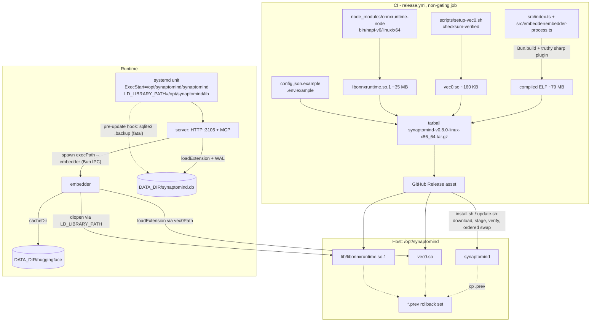

# ADR 0001: Self-contained binary tarball distribution

- **Status:** Accepted
- **Date:** 2026-09-30
- **Author:** architect (task #1033, epic #1032)
- **Scope:** `deploy/` (install/update/updater/app.env/lib/common.sh/hooks), `.github/workflows/release.yml`, the app-side path resolution in `src/version.ts`, `src/db/init.ts`, `src/index.ts`, `src/embedder/client-core.ts`
- **Decision type:** distribution-format change; no new runtime dependency, no schema change, no public API change
- **Supersedes:** nothing. `DIST="source"` (`deploy/app.env:14`) stops being the default but stays supported forever as the developer/debug channel.
- **Related:** epic #1032, build recipe on task #1034, AGENTS.md §6 (release procedure), §8 (known pitfalls), `docs/DEPLOY.md`
- **Convention note:** this is the first ADR kept in-repo under `docs/adr/` with a zero-padded sequence number. Earlier design ADRs live in `ai-workdir/synaptomind/plans/` with date-prefixed names (`docs/API.md:831`, `docs/CONFIG.md:185` cite them by path). Deployment design is a repo-resident concern — the artifact, the unit and the scripts are all in this repository — so it is versioned with the code it describes. Subsequent ADRs continue the sequence.

---

## 1. Context

### 1.1 Problem

A host install today runs from a git checkout (`deploy/app.env:14` `DIST="source"`, `deploy/app.env:17-18`): the installer clones the repo to `/opt/synaptomind`, installs Bun if missing (`deploy/install.sh:172-188`), and runs `bun install --production` (`deploy/install.sh:235-243`). A production checkout with `node_modules` is ~623 MB, carries a full dev toolchain on the host, and makes the running version a function of whatever the working tree happens to contain. Every release also drags `git`, `unzip` and a Bun runtime into the host's system-dependency surface (`deploy/app.env:37-38`).

The goal is a per-platform tarball published as a GitHub Release asset, installed by the existing `deploy/` framework, that needs **no bun, no `node_modules`, no TypeScript sources, no git** on the host — while embeddings stay on the native onnxruntime backend. The win is dependency and class-of-artifact, not raw size: the footprint goes 623 MB → ~115 MB unpacked, of which 35 MB is a shared library that must ship somewhere (§2.1).

### 1.2 Measured baseline (bun 1.4.2, linux-x86_64, dev host, 2026-09-30)

These were measured, not assumed. Anything the design depends on is in this table.

| # | Finding | Consequence for the design |
|---|---|---|
| M1 | In a compiled binary `import.meta.dir` is `/$bunfs/root` and `process.execPath` is the binary itself | every `import.meta.dir`-relative path breaks; a runtime-mode resolver is mandatory (§2.5) |
| M2 | `bun build --compile` embeds `onnxruntime_binding.node` as `/$bunfs/root/onnxruntime_binding-<hash>.node`; its `RUNPATH=$ORIGIN` resolves inside `/$bunfs`, so `libonnxruntime.so.1` is not found → `ERR_DLOPEN_FAILED` | the shared library must be supplied from outside the executable (§2.2) |
| M3 | `LD_LIBRARY_PATH` pointing at the directory holding `libonnxruntime.so.1` makes the embedded addon load | §2.2 decision is verified, not speculative |
| M4 | `@huggingface/transformers@4.2.0` does a top-level `import sharp from "sharp"` (`node_modules/@huggingface/transformers/dist/transformers.node.mjs:17741`), then branches `else if (sharp)` (`:17754`) and throws `"Unable to load image processing library."` (`:17766`) | the stub must be **truthy**; a falsy stub moves the failure to module load. With a truthy throwing stub a compiled binary produced a real 384-dim embedding from `Xenova/multilingual-e5-small` (recipe on task #1034) |
| M5 | a compiled binary can spawn itself with an argv switch over Bun IPC | embedder self-mode is possible, no second artifact needed (§2.4) |
| M6 | `import pkg from '../package.json' with { type: "json" }` inlines the JSON at build time | the version needs no runtime file read (§2.6) |
| M7 | `synaptomind --version` prints `synaptomind v0.8.0` (`src/index.ts:3-6`), but `app_version()` (`deploy/lib/common.sh:175-181`) strips only the `synaptomind ` prefix → `v0.8.0`, which is then compared against `${TAG#v}` = `0.8.0` (`deploy/install.sh:284`, `deploy/update.sh:143`) → **install aborts** | the version contract must be pinned on both sides (§2.6) |
| M8 | `onnxruntime-node@1.24.3` ships no `darwin-x64` artifact (`node_modules/onnxruntime-node/bin/napi-v6/` has `darwin/arm64` only) | darwin-x64 is impossible; platform matrix is narrow (§2.7) |
| M9 | the HF hub cache warns `Unable to add response to browser cache: EACCES mkdir /$bunfs`; onnxruntime emits a `pthread_setaffinity_np` warning | cosmetic, non-fatal, must be documented so operators do not chase it (§2.12) |

### 1.3 What the deploy framework already does for `DIST=binary`

The vendored `deploy/` framework was written for a binary mode that SynaptoMind never turned on. The following already work and are **not** redesigned here:

- `require_binary_config()` validates `RELEASES_BASE` / `ASSET_PATTERN` / `APP_VERSION_CMD` (`deploy/install.sh:165-170`);
- `default_exec_start()` returns `${INSTALL_DIR}/${APP_NAME}` for binary mode (`deploy/install.sh:121-122`);
- `resolve_binary_version()` normalises a `v`-prefixed tag (`deploy/install.sh:245-256`);
- `install_binary()` downloads → `chmod +x` → version-checks → `mv -f` with the explicit comment *"Atomic swap: replaces the directory entry without truncating a running binary"* (`deploy/install.sh:270-291`);
- `update_binary()` keeps `${INSTALL_DIR}/${APP_NAME}.prev` before swapping and prints a binary rollback command (`deploy/update.sh:131-153`, `:84-94`);
- `current_version()` already branches on `DIST` for the binary path (`deploy/update.sh:53-62`);
- `deploy/app.env.example` already documents the binary block, including the **single-quoted** `ASSET_PATTERN` convention (`deploy/app.env.example:28-32`).

Gaps to close: `install_binary`/`update_binary` assume a *single file* asset, not a tarball (§2.9); the unit exports no `LD_LIBRARY_PATH` (§2.2); the version comparison is unnormalised (§2.6); `CHECKOUT_POLICY` is not honoured in binary mode (§2.10); `updater.sh:128` hard-errors for any `DIST` other than `source` (§2.9).

### 1.4 Constraints

1. `vec0.so` is an external SQLite loadable extension (`src/db/init.ts:13` `database.loadExtension(VEC0_PATH)`) — a single-file distribution is impossible. The unit of distribution is a **tarball**.
2. Native addons cannot be cross-compiled; CI must build on native runners.
3. Migrations are forward-only — the apply loop is `for (const migration of MIGRATIONS) { if (current >= migration.version) continue; … }` (`src/db/init.ts:124-131`) — so a rollback must restore a pre-update DB backup, not just an older binary.
4. Production runs on the dev host and must not be disrupted mid-epic; the migration (§2.11) is a deliberate, separately-scheduled step.
5. No new dependencies. The build must use the JS API (`Bun.build`) because `--compile` on the CLI cannot take plugins (task #1034 recipe).

---

## 2. Decision

### 2.1 Distribution shape and exact tarball layout

**One tarball per platform per release tag, containing the compiled executable plus the two native artefacts it loads at runtime.

Measured component sizes (this host, 2026-09-30): executable ~79 MB, `libonnxruntime.so.1` 35,164,376 B, `vec0.so` 159,816 B — ~115 MB unpacked. The compressed tarball is smaller but the build task must record the real number in the release notes; the epic's "~90 MB" figure counted the executable alone and is optimistic.

Asset URL contract (already implemented in the framework): `${RELEASES_BASE}/${TAG}/${render_template(ASSET_PATTERN)}` (`deploy/install.sh:273-274`, `deploy/update.sh:133-134`, `deploy/lib/common.sh:201-208`).

Archive layout — a **single top-level directory**, so extraction cannot spill into `INSTALL_DIR`:

```
synaptomind-v0.8.0-linux-x86_64.tar.gz
└── synaptomind-0.8.0-linux-x86_64/          # <app>-<version>-<os>-<arch>, no `v` prefix
    ├── synaptomind                          # 0755, compiled ELF ~79 MB (server + embedder, see §2.4)
    ├── vec0.so                              # 0644, sqlite-vec loadable extension (~160 KB)
    ├── lib/
    │   └── libonnxruntime.so.1              # 0644, ~35 MB, copied verbatim from onnxruntime-node
    ├── config.json.example                  # 0644, seeds config.json (install.sh SEED_FILES)
    └── .env.example                         # 0644, seeds .env + SYNAPTOMIND_SECRET
```

| Ships | Does **not** ship | Why |
|---|---|---|
| `synaptomind` (self-contained: JS bundle, `package.json` version inlined, `onnxruntime_binding.node` embedded in `/$bunfs`) | `node_modules/` | 623 MB → ~115 MB unpacked; the only reason a host needed `node_modules` was `bun install` |
| `vec0.so` | TypeScript sources, `tsconfig.json`, `bun.lock` | the bundle is the program; sources would be a second, divergent copy |
| `lib/libonnxruntime.so.1` | `bun`, `bunx`, any system toolchain | M3 — the library is loaded by the dynamic loader, not by the bundle |
| `config.json.example`, `.env.example` | `config.json`, `.env` (live) | `seed_files()` copies the examples **only when the destination is absent** (`deploy/install.sh:300-303`); shipping live config would overwrite a production install |
| — | `sqlite-vec` source tarball, `sharp` | the sharp stub is a build-time alias (M4), never a runtime import |
| — | model weights | downloaded into `${DATA_DIR}/huggingface` on first run (`src/config.ts:67` `cacheDir: './data/huggingface'`) — a cache, not an artifact |

`synaptomind` sits at the **root of the payload**, not under `bin/`, because `default_exec_start()` and every binary path in the framework are `${INSTALL_DIR}/${APP_NAME}` (`deploy/install.sh:121-122,260,289`; `deploy/update.sh:55,151,198`). A nested path would change six call sites for no benefit.

`lib/` is a new sibling directory under `INSTALL_DIR`. It collides with nothing (`seed_files` only writes `config.json`/`.env`; `setup_data` only creates the `data` symlink — `deploy/install.sh:350-357`).

**The tarball is self-verifying before the swap** (required file set): `synaptomind` (executable), `vec0.so`, `lib/libonnxruntime.so.1`. Optional: the two `*.example` files. A missing required file aborts the install with a named error instead of leaving a unit that starts and dies on `ERR_DLOPEN_FAILED`.

### 2.2 Native library discovery: `LD_LIBRARY_PATH` exported by the systemd unit

**Decision.** The unit carries `Environment=LD_LIBRARY_PATH=${INSTALL_DIR}/lib`, rendered by `render_systemd_unit()` only in binary mode, immediately after the existing `Environment=NODE_ENV=production` (`deploy/lib/common.sh:319`).

Rationale:

1. It is the only mechanism **verified** to work (M3). The failure M2 describes is a `dlopen` failure inside the loader's search, and `LD_LIBRARY_PATH` is consulted for every `dlopen`, including the lazy one that loads the embedded `.node`.
2. The child inherits it: `spawn(..., { env: { ...process.env, … } })` (`src/embedder/client-core.ts:109-110`) propagates the server's environment to the embedder, so one unit line covers both roles.
3. `render_systemd_unit()` is the single place that already interpolates `${INSTALL_DIR}` into `WorkingDirectory` and `ExecStart` (`deploy/lib/common.sh:318,322`), and the unit is installer-owned and regenerated on every install/update (`deploy/install.sh:436-453`). Nothing else in the framework needs to learn about the library.

Value is exactly `${INSTALL_DIR}/lib` — no concatenation, no inheritance of an administrator's value, no new `app.env` key. The unit is machine-generated; an operator who needs more edits `/etc/systemd/system/synaptomind.service` or adds an `/etc/ld.so.conf.d/synaptomind.conf` entry, and both are documented (§2.12).

The **server** process itself does not need the variable: `@huggingface/transformers` is imported only by the embedder side (`src/embedder/model.ts:1` → `src/embedder/embedder-process.ts:5`), never by the HTTP/MCP server. Exporting it for the whole unit is still correct because the embedder is a child of the server.

Rejections:

| Option | Why rejected |
|---|---|
| `patchelf --set-rpath '$ORIGIN/../lib'` on the executable | The failing `dlopen` is of the **embedded** `.node`, whose own `RUNPATH=$ORIGIN` resolves to `/$bunfs`. The outer executable's `RUNPATH` is not consulted for the addon's dependency search. Patching the executable fixes nothing. |
| `patchelf` on `onnxruntime_binding.node` before compiling | The addon still lives at `/$bunfs/root` at runtime, so `$ORIGIN` is useless, and the only alternative — an absolute `RUNPATH` — hardcodes `INSTALL_DIR` into the artifact and breaks `--dir`, relocation and reproducibility. |
| Wrapper script `start.sh` that exports the variable and `exec`s the binary | Works, but breaks the framework's artifact contract: `install.sh` `chmod +x`s and `app_version`s the artifact itself (`deploy/install.sh:281-283`), `update.sh` `mv -f`s it atomically (`deploy/update.sh:151`), and the rollback moves `${INSTALL_DIR}/${APP_NAME}.prev` (`deploy/update.sh:88-89`). With a wrapper, the atomic unit becomes a two-file move, and the ELF gains a second name. Kept as the documented **manual-start** form only (§2.12). |
| Patch `onnxruntime-node`'s JS to load the library by absolute path | Forks a dependency, is version-fragile across `onnxruntime-node` bumps, and is effectively a new dependency — excluded by the epic constraints. Not needed (M3). |
| Relocate the library into `/usr/lib` via a system package | Requires root at runtime for the host's library path, couples the artifact to distro packaging, and makes two installs of different versions collide. |

### 2.3 `vec0.so` location contract

**Default: `${INSTALL_DIR}/vec0.so`**, i.e. the `vec0.so` at the root of the payload — byte-identical to the source-mode layout, where `scripts/setup-vec0.sh:9-11` places it at the repository root. One name, one location, both modes.

Resolution order (single shared helper, §2.5):

1. `SYNAPTOMIND_VEC0_PATH` — absolute path, used verbatim. The escape hatch.
2. `dirname(process.execPath) + '/vec0.so'` — in a compiled binary `process.execPath` is the binary itself (M1), so this is the payload root. In source mode it points at the Bun runtime's directory, where no `vec0.so` exists, so the check simply fails and resolution falls through to (3).
3. The existing source path, `${import.meta.dir}/../../vec0.so` — unchanged behaviour for `bun run src/index.ts` and for every existing test.

Compiled-mode detection: `import.meta.dir` starts with `/$bunfs` (M1, bun 1.4.2). It is checked only to order the candidates, never to fail; a future Bun that changes the prefix degrades to "binary mode looks in the wrong place", which the env override fixes, and §3 verification asserts both layouts so the marker cannot rot unnoticed.

`src/db/init.ts:8` (`const VEC0_PATH = ${import.meta.dir}/../../vec0.so`) is replaced by a call to the shared resolver, and the existing failure message (`src/db/init.ts:14-19`) gains the resolved path plus the `SYNAPTOMIND_VEC0_PATH` hint. `src/test/helpers.ts:13` has a **duplicate** of the same constant and must be switched to the shared resolver in the same change, otherwise tests validate a path production no longer uses.

`install.sh` places it by extraction — no extra step, no postinstall hook. The `postinstall` script (`package.json:19` `scripts/setup-vec0.sh`) is meaningless for a binary host and simply never runs there; the download+checksum logic (`scripts/setup-vec0.sh:31-81`) is reused **at build time** by CI to obtain the artefact, which is why the shipped `vec0.so` is checksum-verified once, at release time, rather than at install time.

### 2.4 Embedder self-mode: one binary, two roles

**Contract.** `synaptomind --embedder` runs the embedder and nothing else. `src/index.ts` gains one branch at the very top of its bootstrap:

```
--version / -v   →  print and exit                       (existing, src/index.ts:3-6)
--embedder       →  await import('./embedder/embedder-process'), then park (see below)
otherwise        →  existing server bootstrap            (HTTP + MCP + jobs, src/index.ts:8 onward)
```

`--embedder` MUST be checked after `--version` (so `--version` still wins when both are passed) and MUST be checked before any of the server bootstrap, so embedder mode never opens a port, never starts a scheduler and never registers MCP tools. This matters because `src/embedder/embedder-process.ts` is a **side-effect module**: it runs `initDb()` (`:190`), `await ensureModelFiles(...)` (`:196`), `startWorker()` (`:198`) and `process.send?.({ type: 'ready' })` (`:199`) at import time, then owns the event loop until the idle timeout or a `shutdown` message.

**Control DOES return from `await import()`** — a module's top-level evaluation completes at `:199`, and the importer resumes with the poll, sweep and idle timers installed. The branch must therefore **park** on a promise that never settles (`await new Promise<never>(() => {})`) rather than call `process.exit(0)`. An exit at that point kills the very timers that own the event loop: the child dies with code 0 (measured: ~76 ms) before the parent ever sees `ready`, and `/health` stays `"embedder":"not ready"` forever. Source mode never exposed this, because there the file is the entry point and never returns to a caller. With the park, process lifetime is governed only by the module's own idle timeout or a parent `shutdown` message — both of which call `process.exit` themselves. *(Corrected after implementation; the earlier draft wrongly stated that control does not return and proposed the trailing `process.exit(0)` as a defensive guard. That sentence caused the defect it was meant to describe.)*

Client side — `src/embedder/client-core.ts:65`:

| Mode | argv |
|---|---|
| compiled | `[process.execPath, '--embedder']` |
| source (`bun run`) | `[process.execPath, 'run', <import.meta.dir>/embedder-process.ts]` (unchanged) |
| test hook | `SYNAPTOMIND_EMBEDDER_SCRIPT` set → the existing `run <path>` form, unchanged (`src/embedder/client-core.ts:39`) |

`process.execPath` is already the correct executable to spawn in both modes (M1, and the comment at `src/embedder/client-core.ts:61-64` explains why the absolute path is used instead of `bun` on `PATH`). The IPC contract is untouched: the same Bun `spawn({ ipc })` channel, the same message types (`src/embedder/client-core.ts:8-15`), the same dispatch through `handleEmbedderRequest` (`src/embedder/embedder-process.ts:30-32`). This is what makes the fallback in §4 cheap: a fallback that ships a second executable changes exactly one argv array and one build step.

**Direct consequence:** a binary-mode host needs no `bun` and no `bun` on `PATH`. `render_systemd_unit()` already tolerates an empty `BUN_BIN` (it then renders `PATH=/usr/local/bin:/usr/bin:/bin`, `deploy/lib/common.sh:304,321`), so the unit is correct for a host without Bun.

### 2.5 One runtime-mode resolver, three call sites

The measured failure mode is that *every* `import.meta.dir`-relative path silently becomes `/$bunfs/…` (M1). There are exactly three such call sites in production code plus one in test helpers:

| Call site | Today | Becomes |
|---|---|---|
| `src/version.ts:4-6` | `readFileSync(resolve(import.meta.dir, '../package.json'))` | inlined JSON import (M6) |
| `src/db/init.ts:8` | `${import.meta.dir}/../../vec0.so` | `vec0Path()` (§2.3) |
| `src/embedder/client-core.ts:39,65` | `${import.meta.dir}/embedder-process.ts`, spawned as `run <script>` | `isCompiled()`-gated argv, §2.4 |
| `src/test/helpers.ts:13` | duplicated `VEC0_PATH` | `vec0Path()` |

A new `src/runtime-mode.ts` exports `isCompiled()`, `appRootDir()` and `vec0Path()`; the embedder argv decision lives with the client that owns it. One rule, one place, no fourth copy of "where am I running" (AGENTS.md §4 DRY). `VERSION` keeps its name and type so `src/services/health.service.ts:4,32` and every consumer are unaffected.

### 2.6 Version contract (pinned, both sides)

**Contract.** `synaptomind --version` MUST print exactly `synaptomind v<package.json version>` (one line, `src/index.ts:3-6`, e.g. `synaptomind v0.8.0`). The deploy side compares the **tag**, so every comparison normalises the binary's output through the existing `normalize_v()` (`deploy/lib/common.sh:185-190`):

```
got="$(app_version "$bin")"          # "v0.8.0"  (prefix stripped, v kept — common.sh:175-181)
[ "$(normalize_v "$got")" = "$TAG" ] # "v0.8.0" = "v0.8.0"  ✅
```

Applied at all three comparison points: `binary_up_to_date_check()` (`deploy/install.sh:263-267`), `install_binary()` (`deploy/install.sh:283-286`) and `update_binary()` (`deploy/update.sh:142-145`).

`binary_up_to_date_check()` is not cosmetic: today `ver_cmp "v0.8.0" "0.8.0"` (`deploy/lib/common.sh:193-198`) sorts `0.8.0` first, so an already-current install reports **`newer`** and `install.sh` errors with *"newer version v0.8.0 is already installed; use --force"* (`deploy/install.sh:266`). Normalising fixes install and update in one line each.

`normalize_v` is deliberately **not** applied to the health-check side: `/health` reports the bare `VERSION` (`src/services/health.service.ts:32`) and `EXPECTED_VERSION` is `${TAG#v}` (`deploy/install.sh:546`, `deploy/update.sh:217`), which already match. `wait_health` also accepts `degraded` as healthy by deliberate SynaptoMind deviation (`deploy/lib/common.sh:263-266`), which is what lets a first binary install pass its health check while the embedder model is still downloading.

### 2.7 Asset naming and platform matrix

| Property | Value |
|---|---|
| Asset name | `${APP_NAME}-${TAG}-${OS}-${ARCH}.tar.gz` → `synaptomind-v0.8.0-linux-x86_64.tar.gz` |
| Archive root dir | `synaptomind-<version>-<os>-<arch>` (no `v`) |
| `OS` values | `linux`, `darwin` — from `detect_os()` (`deploy/lib/common.sh:105-111`) |
| `ARCH` values | `x86_64`, `arm64` — from `detect_arch()` (`deploy/lib/common.sh:113-119`); note `x86_64`, **not** `x64` (`ARCH_SRC` is the Bun-assets spelling and is not used in the asset name) |
| Tag | `v<version>`, created by `release.yml:57` and pushed at `release.yml:172-180` |

**v1 ships `linux-x86_64` only.** Justification:

- It is the only platform the epic's evidence was measured on, and the only one with a deployable test host.
- `darwin-x64` is **impossible**, not merely deferred: `onnxruntime-node@1.24.3` publishes no `darwin/x64` directory (M8). A darwin binary would fail at `dlopen` exactly as M2 describes.
- `linux-arm64` and `darwin-arm64` are *buildable* — `onnxruntime-node/bin/napi-v6/linux/arm64/libonnxruntime.so.1` and `darwin/arm64/libonnxruntime.1.24.3.dylib` exist, and `scripts/setup-vec0.sh:17-29` maps both — but shipping an artefact that no runner ever executed would violate the "verify before release" gate. They are v2 candidates, gated on owning an arm64 runner (a `self-hosted` label) and adding it to the build matrix.

Because `detect_os`/`detect_arch` accept four combinations while only one has an asset, **`require_binary_config()` gains an explicit supported-platform preflight** (`deploy/install.sh:165-170`): a `darwin`/`arm64` host must fail with *"no release asset for `<os>-<arch>`; supported: linux-x86_64"*, not with a `download failed: …404` from `url_get` (`deploy/install.sh:280`).

Release plumbing: the tarball is built and uploaded by a **new non-gating job** in `.github/workflows/release.yml`, alongside `publish-docker` (`:202-208`), so a packaging failure can never block the canonical GitHub Release. Native addons forbid cross-compilation, so the matrix starts as a single `ubuntu-latest` runner.

### 2.8 Exact `deploy/app.env` values

`deploy/app.env:14` flips, and a binary block is added. `deploy/app.env.example` must be updated in the same change (the two files are not currently identical — `app.env.example` is the generic template — so only the SynaptoMind-specific file is authoritative here; the example's comments stay valid).

```bash
# ── Distribution ───────────────────────────────────────────────────────────
DIST="binary"

# ── binary mode ────────────────────────────────────────────────────────────
RELEASES_BASE="https://github.com/zumik3-del/synaptomind/releases/download"
RELEASE_API="https://api.github.com/repos/zumik3-del/synaptomind/releases?per_page=30"
ASSET_PATTERN='${APP_NAME}-${TAG}-${OS}-${ARCH}.tar.gz'
APP_VERSION_CMD='${BIN} --version'

# ── source mode (retained for developer installs) ──────────────────────────
REPO_URL="https://github.com/zumik3-del/synaptomind.git"
CHECKOUT_POLICY="stable"

# ── binary-mode host requirements ──────────────────────────────────────────
REQUIRES_BUN="no"          # was "yes" (app.env:37) — no bun on a binary host, at install or at runtime
SYSTEM_DEP_CMDS="git tar"  # was "git"  (app.env:38) — tar extracts the payload, git is only the updater bootstrap (§2.9)
```

Non-negotiable details:

- **The single quotes on `ASSET_PATTERN` and `APP_VERSION_CMD` are required, not stylistic.** `load_app_env()` *sources* the file (`. "$f"`, `deploy/lib/common.sh:350`), so a double-quoted `${APP_NAME}-${TAG}-${OS}-${ARCH}` would be expanded to `synaptomind--` at source time and `render_template()` would then have nothing to substitute. The template already demonstrates the convention (`deploy/app.env.example:31-32`).
- `APP_VERSION_CMD` keeps the `${BIN}` placeholder: `app_version()` invokes it as `BIN="$bin" sh -c "$cmd"` (`deploy/lib/common.sh:178`).
- `SYSTEM_DEP_CMDS="git tar"`: `install_system_deps()` (`deploy/install.sh:135-157`) installs them through apt/dnf/yum/apk/pacman and skips cleanly when present. `tar` is the extraction tool; `git` survives only because the frozen `updater.sh` bootstrap shallow-clones the release to stage that release's own `deploy/update.sh` (`deploy/updater.sh:86-101,129`) — a bootstrap dependency, not a runtime one (§2.9). `unzip` is no longer needed (it was never listed).
- `RELEASE_API` points at the **list**, not `/releases/latest`, because `release_latest_tag()` (`deploy/lib/common.sh:231-242`) cannot express a channel policy and `/releases/latest` silently excludes prereleases. See §2.10.
- `SEED_FILES` (`deploy/app.env:26`) and `GENERATE_SECRET_IN` (`:27`) are unchanged and now resolve against the extracted payload.

### 2.9 Install, update, rollback

**Install / update = staged extract, verify, ordered swap.** `install_binary()` (`deploy/install.sh:270-291`) and `update_binary()` (`deploy/update.sh:131-153`) become one shared sequence; the framework's existing steps — download, verify version, keep `.prev`, `mv -f` — are preserved, with staging inserted around them:

1. Download `${RELEASES_BASE}/${TAG}/${asset}` to `${INSTALL_DIR}/.${APP_NAME}.$$.tar.gz` (`url_get`, `deploy/lib/common.sh:218-229`).
2. `staging="$(mktemp -d "${INSTALL_DIR}/.stage.XXXXXX")"` — inside `INSTALL_DIR`, so every later `mv` is a same-filesystem rename.
3. `tar -xzf <tarball> -C "$staging" --no-same-owner`, then require exactly one top-level directory; the payload is `<staging>/<top>`. Extracting into a dedicated directory (never `-C "$INSTALL_DIR"`) is what makes a malformed archive harmless.
4. Verify the required set (§2.1): `synaptomind` executable, `vec0.so`, `lib/libonnxruntime.so.1`. Missing → `error`, nothing has been touched yet.
5. Version check: `app_version "$staging/<top>/synaptomind"`, `normalize_v`, compare with `$TAG` (§2.6).
6. Keep the previous payload: for each file that already exists in `INSTALL_DIR`, `cp -f "$INSTALL_DIR/$f" "$INSTALL_DIR/$f.prev"` — `synaptomind.prev` (already the framework's rollback anchor, `deploy/update.sh:147-150`) plus `vec0.so.prev` and `lib/libonnxruntime.so.1.prev`. `install.sh` skips this step for a fresh install.
7. Ordered swap (`mkdir -p "$INSTALL_DIR/lib"` first):
   `vec0.so` → `lib/libonnxruntime.so.1` → `config.json.example` → `.env.example` → **`synaptomind` last**.
8. `rm -rf "$staging"`; `seed_files()` / `generate_secret_into()` / `setup_data()` / helper+hook install / unit render follow in their existing order (`deploy/install.sh:552-562`).

**Why the executable moves last.** A multi-file swap is not atomic as a set; the only question is which interrupted state is *detectable*. With the executable last, an interrupted swap leaves *old executable + new data files* — which is exactly the state a deliberate downgrade produces, so `app_version` still reports the old version and the next run is a no-op or a clean retry. With the executable first, an interrupted swap reports the **new** version while running the **old** `libonnxruntime.so.1`: a silent inconsistency that no existing check would catch. A `mv` loop over four files takes microseconds, and nothing starts the app inside that window, so the practical exposure is nil either way — this ordering is chosen because its failure mode is honest.

**Rollback** (no automatic revert, unchanged philosophy — `deploy/update.sh:84-94`):

```bash
sudo systemctl stop synaptomind
cd /opt/synaptomind
for f in synaptomind vec0.so lib/libonnxruntime.so.1; do
  [ -f "$f.prev" ] && sudo mv -f "$f.prev" "$f"
done
sudo cp data/synaptomind.db.backup/synaptomind.db.<timestamp>.bak data/synaptomind.db
sudo rm -f data/synaptomind.db-wal data/synaptomind.db-shm
sudo systemctl start synaptomind
```

The DB restore is mandatory, not optional: migrations are forward-only (`src/db/init.ts:124-131`), so a pre-upgrade binary against a post-upgrade schema is unsafe. The pre-update hook already produced the backup and is **fatal** before the swap (`deploy/update.sh:259-261`; hook: `deploy/hooks/pre-update:1-10`, WAL-safe `sqlite3 .backup`, per-DB paths from `config.json` at `deploy/hooks/pre-update:35-46`). Neither the hook nor its fatality changes in binary mode. `print_recovery()` must be updated to print the loop above instead of the single-file command (`deploy/update.sh:87-89`).

**`updater.sh` — two surgical changes, not a rewrite.** The frozen bootstrap contract (`deploy/updater.sh:12`) is preserved exactly: same path, same flags, same exit codes, still stable-only.

- `deploy/updater.sh:128` (`[ "${DIST:-source}" = "source" ] || error "updater supports DIST=source only"`) must accept `binary` as well.
- `current_version()` (`deploy/updater.sh:58-63`) needs **no** new fallback path: `read_package_version` on a missing `package.json` returns empty and the function already falls back to `parse_json_version` over `$HEALTH_URL`, which in binary mode reports the bare `VERSION` (`src/services/health.service.ts:32`). The only change worth making is to prefer `app_version` for a binary install (authoritative, offline, no HTTP), keeping the health probe as the fallback. *(The task brief listed the `package.json` read as a blocker; inspection shows the fallback already exists — the blocker is the guard on line 128, not line 60.)*
- `REPO_URL` stays **required** (`deploy/updater.sh:129`): the bootstrap shallow-clones the tag to stage that release's own `deploy/update.sh` (`deploy/updater.sh:86-101`). Binary hosts therefore still need `git` and network access to the repository — but not the repository *on disk*, and not a checkout in `INSTALL_DIR`. This is the one place where "no git on the host" does not hold, and it is a bootstrap dependency, not a runtime one; the ADR accepts it rather than redesigning the frozen contract. It is also why `SYSTEM_DEP_CMDS` is `"git tar"` (§2.8), not `"tar"`.
- `stage_release()` copies the **installed** `app.env` (`deploy/updater.sh:98`), so an already-installed host keeps its own `DIST`, `INSTALL_DIR`, `DATA_DIR` and `PORT` — the correct behaviour, and the reason §2.11 needs an explicit migration step rather than relying on the updater.

### 2.10 Channel semantics: `CHECKOUT_POLICY` → tag → asset

| `CHECKOUT_POLICY` | Tag selected | Source |
|---|---|---|
| `stable` (default) | newest `v<semver>` with no `-` | release list, `draft == false`, filter `tag !~ /-/`, `sort -V \| tail -1` |
| `latest` | newest `v<semver>` of any kind | same list, `draft == false`, all tags |
| `prerelease` | newest `-alpha.` / `-beta.` / `-rc.` | same list, filter `~ /-(alpha\|beta\|rc)\./` |
| `<branch>` | **rejected in binary mode** | `error "CHECKOUT_POLICY=<branch> requires DIST=source"` — a branch has no release asset |

`resolve_source_ref()` (`deploy/lib/common.sh:148-160`) already encodes exactly this tag-selection matrix over `git tag`; binary mode reuses the same policy through a new `release_resolve_tag()` that applies it to the `RELEASE_API` list. The existing `release_latest_tag()` (`deploy/lib/common.sh:231-242`) — one `sed` for the first `"tag_name"` — stays for the `stable` fast path and is replaced by the policy-aware helper in `install.sh:246-256` and `update.sh:208-218`. `updater.sh` remains stable-only by contract (`deploy/updater.sh:49-56`), so the prerelease channel continues to require a direct `update.sh` run, exactly as `docs/DEPLOY.md:144-153` documents today.

Operational caveat to document: the unauthenticated GitHub API allows 60 requests/hour per IP. A 403/429 must surface as an explicit "cannot resolve the latest release (GitHub API rate limit or network); re-run with --version <tag>" error. `--version` (`deploy/install.sh:96-110`, `deploy/update.sh:41-50`) remains the always-available path.

### 2.11 Migration of an existing `DIST=source` install

The live host (`/opt/synaptomind` checkout, `${HOME}/.synaptomind/scripts/app.env` with `DIST="source"`, DB in `/var/lib/synaptomind`) must keep serving. **The migration is a reinstall into the same directory, not an in-place mode flip**, for three reasons:

1. The installed `app.env` is never refreshed by the updater — `stage_release()` copies the host's own copy into the staging dir (`deploy/updater.sh:98`). Editing the release's `app.env` has no effect on an installed host, so a flip can only be hand-edited locally, and a hand-edited host is not reproducible.
2. Switching modes with the *old* helpers in place would run source-mode `update.sh` against a binary directory; the payload extraction simply does not exist in that code.
3. A reinstall is idempotent for state: `seed_files()` preserves an existing `config.json`/`.env` (`deploy/install.sh:300-303`), `setup_data()` re-links the existing `DATA_DIR` (`deploy/install.sh:350-357`), and the DB itself is never re-created because it lives in `DATA_DIR`, not in `INSTALL_DIR`.

Sequence (run in a maintenance window, after the first stable release that ships both the assets and the binary-capable `deploy/`):

```bash
# 0. keep the current unit so the rollback is a file copy
sudo cp -a /etc/systemd/system/synaptomind.service /var/tmp/synaptomind.service.source-bak

# 1. stop; snapshot the only state that lives in INSTALL_DIR (the DB is in DATA_DIR)
sudo systemctl stop synaptomind
sudo mkdir -p /var/tmp/sm-migrate
sudo cp -a /opt/synaptomind/config.json /opt/synaptomind/.env /var/tmp/sm-migrate/

# 2. park the checkout (it is the rollback path — do not delete it) and pre-place
#    the live config so the installer preserves it instead of seeding fresh state
sudo mv /opt/synaptomind /opt/synaptomind.source-bak
sudo mkdir -p /opt/synaptomind
sudo cp -a /var/tmp/sm-migrate/config.json /var/tmp/sm-migrate/.env /opt/synaptomind/

# 3. install the binary: extracts the payload, rewrites the unit, starts, polls /health
sudo bash deploy/install.sh          # from the release tag, or the piped one-liner

# 4. acceptance gate
curl -fsS http://127.0.0.1:3105/health
```

Why the config is pre-placed in step 2, and why `--no-service` is **not** used here:

- `seed_files()` skips any destination that already exists (`deploy/install.sh:300-303`), so a pre-placed `config.json`/`.env` is preserved byte-for-byte; `generate_secret_into()` then returns early (`deploy/install.sh:335`) and **`SYNAPTOMIND_SECRET` is never regenerated**, which would otherwise invalidate every existing client token. If they were seeded fresh, the secret would rotate mid-migration.
- The port in the preserved `config.json` is what `resolve_port()` reads (`deploy/lib/common.sh:247-255`), so `HEALTH_URL` and the unit stay on 3105 even though `app.env` says `PORT="3105"`.
- `--no-service` would skip the unit install (`deploy/install.sh:422`) and leave the old source-mode unit — `ExecStart=<bun> run src/index.ts` (`deploy/install.sh:123-131`) — pointing at a directory that no longer exists, so the service could not be started afterwards. The installer must run to completion: it is the only thing that rewrites `ExecStart` to `/opt/synaptomind/synaptomind` (`deploy/install.sh:121-122`) and the only thing that polls `/health`.
- The health probe is the gate (`deploy/lib/common.sh:267-296`): it must answer with the expected `version`, and `degraded` is accepted (deliberate deviation, `deploy/lib/common.sh:263-266`) so a first run whose embedder model is still downloading still passes.

Rollback of the migration (the parked checkout is intact and the DB was never re-created, because `DATA_DIR` is unchanged):

```bash
sudo systemctl stop synaptomind
sudo rm -rf /opt/synaptomind
sudo mv /opt/synaptomind.source-bak /opt/synaptomind
sudo cp -a /var/tmp/synaptomind.service.source-bak /etc/systemd/system/synaptomind.service
sudo systemctl daemon-reload && sudo systemctl start synaptomind
```

Sequencing, because production is the dev host (`AGENTS.md` §8 warns that a "sandboxed" demo of these scripts restarted the live service five times on 2026-09-16): land the release on `main` → rehearse the whole sequence on a clean Debian LXC → only then run it here. `deploy/install.sh.test.ts` and `deploy/updater.sh.test.ts` must be extended in the deploy task with a binary-mode fixture; no `sudo`/`systemctl` may be invoked from a test (`AGENTS.md` §8).

### 2.12 Known non-fatal noise (documented, not fixed here)

- `Unable to add response to browser cache: EACCES mkdir /$bunfs` — the HF hub tries to write a browser cache into the read-only embedded filesystem. Harmless; the model cache is `${DATA_DIR}/huggingface` (`src/config.ts:67`). Cosmetic fix if ever wanted: point the hub at an env-configured cache.
- `pthread_setaffinity_np` warning from onnxruntime — runtime-informational.
- **Manual start without systemd** (the only supported non-unit path):
  `LD_LIBRARY_PATH=/opt/synaptomind/lib /opt/synaptomind/synaptomind` — without it the embedder child dies with `ERR_DLOPEN_FAILED: libonnxruntime.so.1` (M2/M3). This one line belongs in `docs/DEPLOY.md` and in the troubleshooting section of the release notes; it is the single most likely operator confusion in this design.

---

## 3. Consequences

### 3.1 What each slice must change (ordered, no improvisation)

| Slice | Change points (non-exhaustive) |
|---|---|
| App (#1034) | `src/runtime-mode.ts` (new); `src/version.ts` → inlined JSON (M6); `src/db/init.ts:8,14-19`; `src/embedder/client-core.ts:39,65`; `src/index.ts` `--embedder` branch; `src/test/helpers.ts:13`. Build script with the truthy sharp stub via the `Bun.build` JS API (`plugins` + `compile`) — the `--compile` CLI cannot take plugins. |
| Build & release | new non-gating `release.yml` job: install deps → `Bun.build` compile → stage payload (§2.1) → `tar` → upload. `scripts/setup-vec0.sh` supplies `vec0.so`; `node_modules/onnxruntime-node/bin/napi-v6/linux/x64/libonnxruntime.so.1` supplies the library (M8 pins the path). |
| Deploy | `install.sh:165-170` (platform preflight), `:259-291` (staged swap, `normalize_v`, `.prev` set, `tar`); `update.sh:131-153` + `:84-94` (same + recovery text); `updater.sh:128` (DIST guard) and `:58-63` (`app_version` preference); `common.sh:301-339` (`LD_LIBRARY_PATH` when `DIST=binary`), `:231-242` → policy-aware `release_resolve_tag`; `app.env:14,37-38` + binary block; `app.env.example` comments. |
| Docs | `docs/DEPLOY.md:63-71` (what the installer does), `:79-91` (channels table gains "no branches in binary mode"), `:174-195` (rollback loses `git checkout`/`bun install`, gains the loop), plus the manual-start line from §2.12; `AGENTS.md` §6 release procedure gains the asset step. Docwriter task — not in this ADR. |

### 3.2 Verification (each slice is independently checkable)

- **App**: a compiled binary must answer `--version`, serve `/health` with the expected version, and produce a 384-dim embedding for `Xenova/multilingual-e5-small` **with no `bun`, no `node_modules` and no source tree next to it**. The `--embedder` self-spawn must reach `ready` and answer one `request` over IPC.
- **Deploy**: the staged swap must be exercised against a fake `RELEASES_BASE` (a `file://`-style local fixture) asserting: bad version → no file in `INSTALL_DIR` changed; missing `lib/libonnxruntime.so.1` in the tarball → named error, no swap; interrupted swap → `app_version` still reports the previous version.
- **Production**: `/health` reports the expected version after the §2.11 sequence, and the DB row counts match pre-migration.

### 3.3 Trade-offs accepted

- **The unit becomes load-bearing for the native library.** A host that starts the binary by hand without the variable gets a working server and a failing embedder — a *degraded*, not a broken, service. Mitigated by documenting the one-line form (§2.12) and by the error text naming the fix.
- **The payload is not atomic as a set.** Bounded by microseconds and by the executable-last ordering (§2.9).
- **`vec0.so` and `libonnxruntime.so.1` are duplicated per version in `INSTALL_DIR`** (~35 MB per release kept as `.prev`) because rollback keeps one previous copy of each. This is the price of a no-`git` rollback; if disk ever matters, the `.prev` copy of the library is the first thing to drop — the executable's `.prev` plus a reinstall of the same version would still be recoverable.
- **The bootstrap still needs `git`** on the host (`deploy/updater.sh:92,129`). Accepted to keep the frozen contract; the *runtime* needs nothing.
- **`/$bunfs` prefix detection is version-coupled** (bun 1.4.2, M1). `SYNAPTOMIND_VEC0_PATH` is the escape hatch, and verification asserts both layouts.
- **A release asset per platform per tag** multiplies release size (~115 MB unpacked × platforms) and makes each release a build-host dependency rather than a pure-Python-style artifact step.

### 3.4 Positive consequences

- Host footprint 623 MB → ~115 MB unpacked (~90 MB for the executable, ~35 MB for the runtime library, ~160 KB for `vec0.so`); no bun, no `node_modules`, no `git` **at runtime**, no source tree on disk.
- The installed version is a named, immutable artefact (`--version` verifies it at install time, `deploy/install.sh:283-286`) rather than a working-tree state.
- One deploy framework serves both modes; `DIST` is a one-line switch and `DIST=source` remains a supported, tested escape hatch for developers and for any packaging regression.
- Releases become installable on hosts that are not developer machines, and the release asset is verifiable independently of the repository.

---

## 4. Alternatives considered

### 4.1 Single-file distribution via `onnxruntime-web` / WASM — **rejected**

Rejected on two independent grounds, either sufficient:

1. **It does not achieve a single file.** `vec0.so` is an external SQLite loadable extension loaded at `initDb()` (`src/db/init.ts:13`); no bundler can inline a `.so` that SQLite's extension loader `dlopen`s. The unit of distribution is a directory; a tarball is the smallest correct container.
2. **It buys nothing and costs the hot path.** The native backend is what the verify/auto-link/cluster jobs and `POST /api/thoughts/propose` embeddings run on. A WASM backend would change embedding numerics for the same model, which forces re-baselining of the verify drift threshold (`SYNAPTOMIND_DRIFT_THRESHOLD`, `src/config.ts:174`) and re-validating every recall-quality number in `docs/BENCHMARK.md` — to solve a packaging problem that a tarball already solves. No new dependency, no numerics change: out of scope for this ADR, deliberately.

### 4.2 Fallbacks if bundling proves unworkable

Ordered by preference; the first that unblocks a release wins, and each is a contained change:

1. **Ship the two addon packages unbundled inside the same tarball** — the bundle stops at the `onnxruntime-node` boundary and `node_modules/onnxruntime-node/{package.json,bin/napi-v6/linux/x64/**}` plus a `sharp` stub file ride along. Same tarball, same unit line, no `bun` on the host. Trigger: a `transformers` upgrade whose import graph cannot be aliased by a plugin.
2. **Compile the embedder as a second artefact** — `synaptomind-embedder` in the same payload, spawned as `[<appRoot>/synaptomind-embedder]` instead of `[process.execPath, '--embedder']`. Exactly one argv array in `client-core.ts` changes (§2.4) and the IPC contract is untouched (`src/embedder/handle-request.ts`). Trigger: self-mode cannot be kept free of server-side side effects.
3. **Revert `DIST` to `source`** — one line in `app.env` (`:14`). This is why `DIST=source` is never deleted: the framework supports both (`deploy/install.sh:535-549`), so a packaging regression degrades to today's behaviour instead of blocking releases.

### 4.3 Other rejected options

| Option | Why rejected |
|---|---|
| Versioned release dirs (`/opt/synaptomind/releases/<tag>/` + `current` symlink) — truly atomic multi-file swap | Requires changing six `${INSTALL_DIR}/${APP_NAME}` path sites (`install.sh:121-122,260,289`; `update.sh:55,151,198`), the `WorkingDirectory`/`ExecStart` rendering (`common.sh:318,322`), and the `.prev` rollback model — all to obtain an atomicity guarantee that §2.9 obtains with four `mv` calls in microseconds. High churn against vendored scripts for a theoretical gain. |
| Container-only distribution (Docker is already published, `release.yml:202-208`) | Does not remove Bun from the host for non-Docker users, adds a runtime, and AGENTS.md §6 already calls `deploy/` the supported install path with Docker as a convenience. Kept as an existing parallel option. |
| Self-extracting shell archive | Wraps the same payload in a `curl \| sh` pattern with no integrity story beyond the version check, and makes the `mv -f` atomicity impossible. Rejected in favour of a plain `.tar.gz` plus `tar` in `SYSTEM_DEP_CMDS`. |
| Shipping `vec0.so` in `/usr/lib` as a distro package | Couples the release to distro packaging and requires root at install; the payload is self-contained by design. |
| Building for Windows | No deployment target; `onnxruntime-node` has a `win32` artefact but `deploy/` is systemd-only (`deploy/install.sh:421-456`). Out of scope. |

---

## 5. Risks

| # | Risk | Likelihood | Impact | Mitigation |
|---|---|---|---|---|
| R1 | `libonnxruntime.so.1` fails to load in production (unit line missing/wrong path) | low | embedder dead, recall quality degrades | preflight assertion in the deploy tests; `ERR_DLOPEN_FAILED` names the exact `LD_LIBRARY_PATH` remedy (§2.12) |
| R2 | A `transformers` upgrade breaks the bundling (new unresolvable top-level import) | **high** over time | release blocked | documented build recipe on #1034 pins the alias; §4.2 fallback chain; the failure is loud at build time, not at install time |
| R3 | `/$bunfs` prefix changes in a future Bun | low | vec0 resolution breaks | `SYNAPTOMIND_VEC0_PATH` escape hatch; verification asserts both layouts each release |
| R4 | Migration mishandled on the live host (AGENTS.md §8: a "sandboxed" demo restarted prod 5×) | medium | outage | rehearse the full §2.11 sequence on a clean Debian LXC first; config pre-placed so the secret never rotates; installer runs to completion so the unit is rewritten; checkout parked (not deleted) and the unit file snapshotted |
| R5 | GitHub API rate limit blocks auto-resolution | low | update needs `--version` | explicit error message with the `--version` remedy (§2.10) |
| R6 | A `.tar.gz` asset is uploaded without `lib/libonnxruntime.so.1` | low | install aborts with a named error | required-file-set check before the swap (§2.9 step 4) |
| R7 | First binary release and binary-capable `deploy/` land in the same tag and the host's `app.env` still says `source` | medium | updater keeps taking the source path | documented in §2.11: the installed `app.env` is authoritative (`updater.sh:98`); the migration is an explicit reinstall, not a silent upgrade |
| R8 | `ProtectSystem=strict` blocks writes the binary needs | low | service starts degraded | `ReadWritePaths` already covers `INSTALL_DIR` and `DATA_DIR` (`common.sh:302-303,329`); model cache lives under `DATA_DIR` via the `data` symlink |

---

## 6. Data flow



```mermaid
sequenceDiagram
    participant op as operator
    participant up as updater.sh (frozen)
    participant sh as release update.sh
    participant db as SQLite DB
    participant svc as systemd

    op->>up: bash ~/.synaptomind/scripts/updater.sh --yes
    up->>up: git ls-remote → newest stable tag (deploy/updater.sh:49-56)
    up->>sh: stage that tag's update.sh + common.sh + installed app.env (:86-101)
    sh->>sh: current_version → app_version (binary) (:53-62)
    sh->>sh: resolve TAG from RELEASE_API + CHECKOUT_POLICY (:208-218)
    sh->>db: pre-update hook — sqlite3 .backup, FATAL on failure (:259-261)
    sh->>sh: download tarball → extract to staging → verify files + version
    sh->>sh: cp *.prev; mv vec0, mv lib, mv executable last
    sh->>svc: systemctl restart (:161)
    svc-->>sh: /health reports TARGET_VERSION (:169)
    alt version mismatch / timeout
        sh-->>op: exit 1 + recovery block (restore .prev set + DB backup)
    end
```

---

## 7. Must-not-improvise (for implementers)

1. `ASSET_PATTERN` and `APP_VERSION_CMD` in `app.env` are **single-quoted** — the file is sourced by bash (`deploy/lib/common.sh:350`).
2. The sharp stub must be **truthy**; a falsy stub makes `transformers` throw at module load (`transformers.node.mjs:17754,17766`).
3. `LD_LIBRARY_PATH` is exported by the **unit**, value exactly `${INSTALL_DIR}/lib`; not by a wrapper script, not baked into the binary.
4. `vec0.so` sits at the **payload root** and is named exactly `vec0.so`; resolution order is env → binary dir → source tree.
5. `--embedder` is checked **after** `--version` and **before** the server bootstrap; the embedder side effects live in an imported side-effect module, so the branch must wrap the whole bootstrap.
6. The executable is moved **last** in the swap; the version comparison is normalised with `normalize_v` on the binary's output only — never on the health side.
7. `updater.sh`'s frozen contract (path, flags, exit codes, stable-only) does not change; only the `DIST` guard and the version read are touched.
8. `RELEASE_API` is the **list** endpoint, not `/releases/latest`; a `CHECKOUT_POLICY` naming a branch is an error in binary mode.
9. `SYSTEM_DEP_CMDS` is `"git tar"` — `git` for the updater bootstrap, `tar` for extraction.
10. The tarball ships no `config.json` and no `.env`; seeding is the installer's job (`deploy/install.sh:294-320`).
