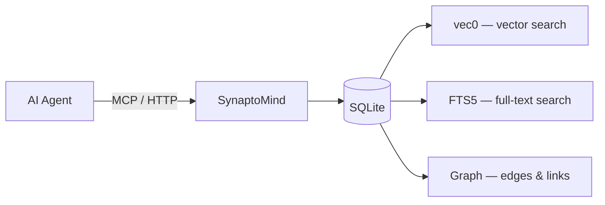

# Architecture

```mermaid
graph LR
    A[AI Agent] -->|MCP / HTTP| B[SynaptoMind]
    B --> C[(SQLite)]
    C --> D[vec0 — vector search]
    C --> E[FTS5 — full-text search]
    C --> F[Graph — edges & links]
```
